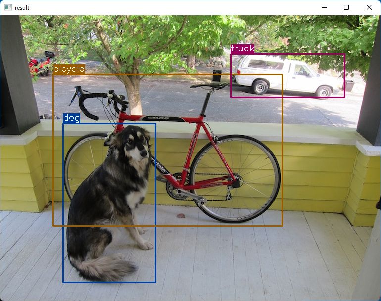

# CenterNet Object Detection with OpenCV in Rust

Sample project to run CenterNet Object Detection with OpenCV in Rust.

## How to Run
1. Install Rust and OpenCV
    - https://www.rust-lang.org/tools/install
    - https://lib.rs/crates/opencv
2. Download the model
    - https://github.com/PINTO0309/PINTO_model_zoo/blob/main/042_centernet/01_float32/download.sh
    - copy `ctdet_coco_dlav0_384.onnx` to `resource/model/ctdet_coco_dlav0_384.onnx`
3. `cargo run`

## Acknowledgements
- https://github.com/PINTO0309/PINTO_model_zoo
- https://github.com/xingyizhou/CenterNet.git

