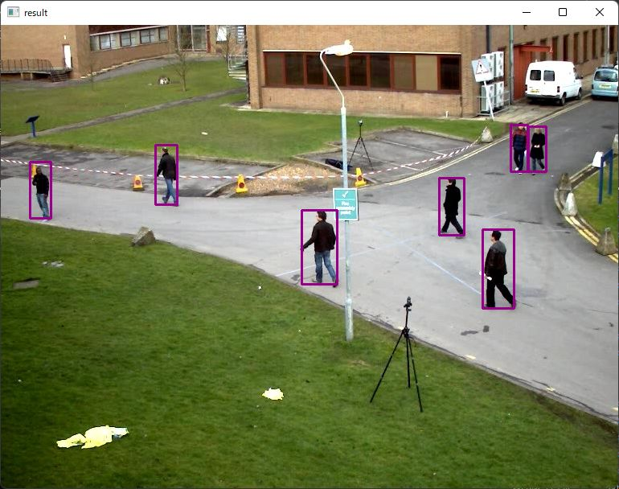

# Person Detection with OpenCV in Rust

Sample project for person detection using "person-detection-0202" model with OpenCV in Rust.

## How to Run
1. Install Rust and OpenCV
    - https://www.rust-lang.org/tools/install
    - https://lib.rs/crates/opencv
2. Download the model
    - https://github.com/PINTO0309/PINTO_model_zoo/blob/main/179_person-detection-0202/download.sh
    - copy `saved_model_512x512/model_float32.onnx` to `resource/model/person-detection-0202_512x512.onnx`
3. `cargo run`

## Acknowledgements
- https://github.com/PINTO0309/PINTO_model_zoo
- https://github.com/openvinotoolkit/openvino

