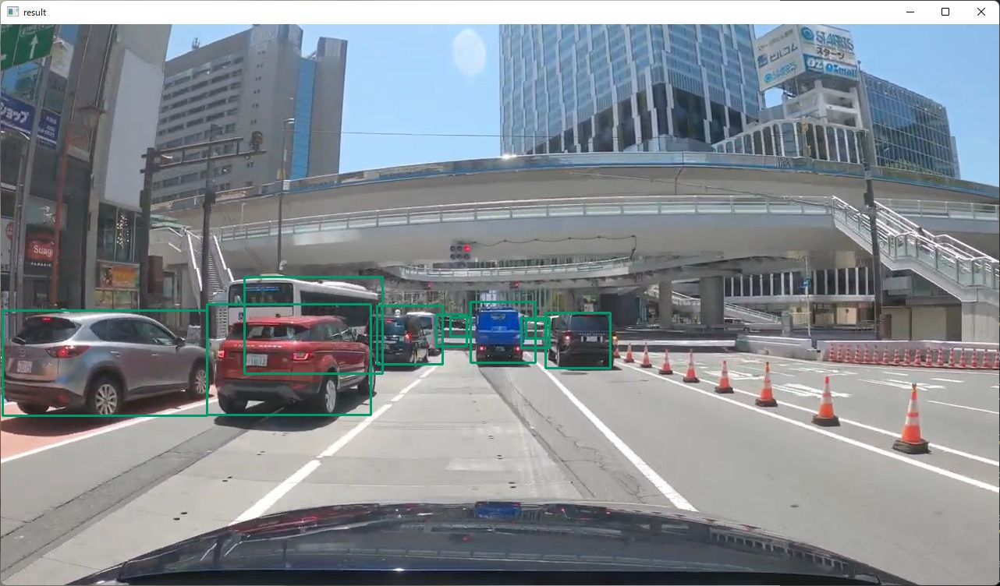

# Vehicle Detection with OpenCV in Rust

Sample project for vehicle detection using "vehicle-detection-0200" model with OpenCV in Rust.

## How to Run
1. Install Rust and OpenCV
    - https://www.rust-lang.org/tools/install
    - https://lib.rs/crates/opencv
2. Download the model
    - https://github.com/PINTO0309/PINTO_model_zoo/blob/main/178_vehicle-detection-0200/download.sh
    - copy `saved_model_256x256/model_float32.onnx` to `resource/model/vehicle-detection-0200_256x256.onnx`
3. `cargo run`

## Acknowledgements
- https://github.com/PINTO0309/PINTO_model_zoo
- https://github.com/openvinotoolkit/openvino

